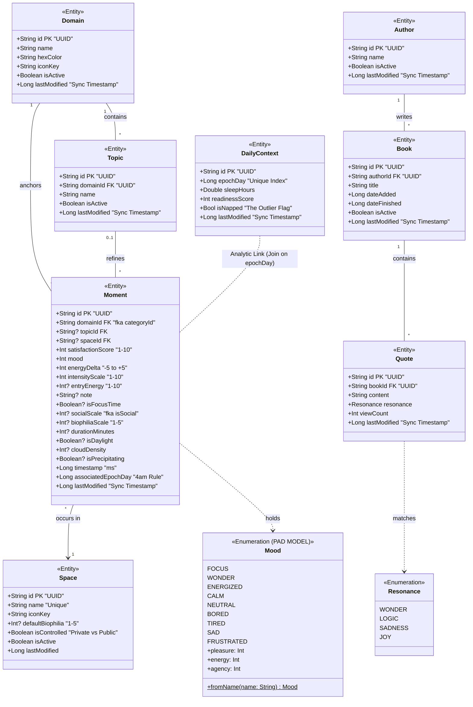

# MochaMe-KMP
## v0.2.0

  

---

<b> Local First Architecture </b>

 

Needs Updating 

  

---

<b> Approach to Gradle Build Design </b>

#### Gradle Build-Logic Configs

###### Core builds to plug in, and what they provide.

##### 1. `mocha.provider` (Lightweight Infrastructure)

**Purpose:** Configures pure structural dependencies and targets for modules that act as APIs or expect/actual providers for simple requirements. Avoids all test runner configuration.

- **Targets Declared:** `jvm()`, `linuxX64()`, `android()`.
- **Source Sets Declared:** None explicitly.
- **Test Runners:** None.
- **Koin Compiler:** Applied.
- **Room Scope:** None.

##### 2. `mocha.logic` (Pure Logic)

**Purpose:** Configures the standard execution environment for pure Kotlin modules that do not define persistence schemas. Essentially just tools.

- **Targets Declared:** `jvm()`, `linuxX64()`, `android()`.
- **Source Sets Declared:** `androidHostTest`, `androidDeviceTest`, `jvmTest`
- **Test Runners:** Standard test runners (`androidHostTest`, `jvmTest`, `linuxX64Test`, iOS) injected - _unit tests_.
- **Koin Compiler:** Applied.
- **Room Scope:** None.

##### 3. `mocha.feature` (Heavy Components)

**Purpose:** Designed exclusively for features that require isolated micro-schemas for testing their integration logic across platforms.

- **Targets Declared:** `jvm()`, `linuxX64()`, `android()`.
- **Source Sets Declared:** `commonMain`: Injects `implementation(libs.room.runtime)` to allow `@Dao` and `@Entity` compilation.
- **Test Runners:** Standard test runners (`androidHostTest`, `jvmTest`, `linuxX64Test`) injected.
- **Koin Compiler:** Applied.
- **Room Scope:** Runtime: Provided to `commonMain`.
- **KSP (Compiler):** Applied strictly to test configurations purely for Room, not Koin (e.g., `kspAndroidHostTest`, `kspJvmTest`). Keeps main targets free of generation overhead - no `@Database` in main, purely in test.

##### 4. `mocha.assembler` (Aggregator)

**Purpose:** Configures the final assembly points where domain DAOs are aggregated into production code.

- **Targets Declared:** `jvm()`, `linuxX64()`, `android()`.
- **Source Sets Declared:** `commonMain`: Injects `implementation(libs.room.runtime)`.
- **Test Runners:** Fully configured.
- **Koin Compiler:** Applied.
- **Room Scope:** Runtime: Provided to `commonMain`.
- **KSP (Compiler):** Applied to standard main configurations (e.g., `kspAndroid`, `kspJvm`). Expect `@Database` in main.

 

---

<b> Serialization Architecture </b>

 

## Outbound

## Inbound

---

<b> Data Model </b>

 

Simply to provide a model for the local-first testing. Only DailyContext is implemented:

The model below is changing, and now includes sync metadata. 

---

<b> Testing Architecture & Commands </b>

 

### Testing 

| Command                        | Target              | Dependencies                   |
|:-------------------------------|:--------------------|:-------------------------------|
| **allTests**                   | `commonTest`        | `kotlin.test`, Turbine         |
| **jvmTest**                    | `jvmTest`           | JUnit 5                        |
| **testAndroidHost**            | `androidHostTest`   | Robolectric, JUnit 4 (Vintage) |
| **connectedAndroidDeviceTest** | `androidDeviceTest` | AndroidJUnitRunner             |
| **linuxX64Test**               | `linuxX64Test`      | Parity with `commonTest`       |

Server tested with `Kotest`, which I would probably integrate into future testing.

---